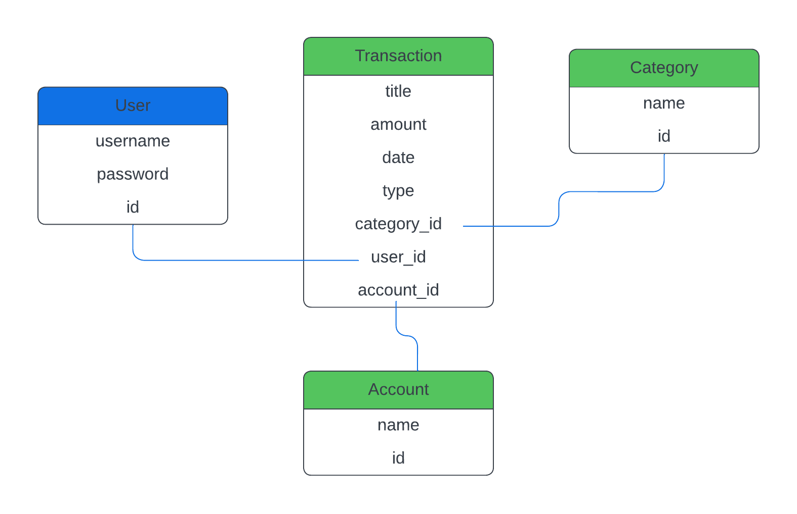

# SEPBT220 Project 4: Personal Finance Tracker App

## Project Description
The Personal Finance Tracker App is a web application designed to help users manage their finances by tracking income, expenses, and account balances. Users can categorize their transactions, view summaries, and filter data to gain insights into their spending habits. The app is built using Django and provides a clean, user-friendly interface with quick backend functionality.

## Project Links
- [Live Demo]()

## Features
- Transaction Management: Add, edit, and delete income and expense transactions with ease.
- Categorization: Assign transactions to predefined categories to organize your financial data.
- Account Management: Manage multiple accounts, view balances, and track financial status. Add and remove accounts as needed.
- Filtering: Filter transactions by date and category to gain better insights.

## Installation Instructions

### Step 1

Clone this project to your local machine.

```bash
git clone https://github.com/jbm97/finance-tracker.git
```

### Step 2

Navigate to the project directory.

```bash
cd finance-tracker/finance_tracker
```

### Step 3

Set up the virutal environment and install dependencies.

```bash
python -m venv .venv
source .venv/bin/activate
pip install -r requirements.txt
```

### Step 4

Create database in Postgres and apply migrations.

```bash
CREATE DATABASE finance_app;
python manage.py migrate
```

### Step 5 (Optional)

Load initial data into transactions list to populate.

```bash
python manage.py loaddata initial_data.json
```

### Step 6 (Optional)

Create a superuser to acceess the Django Admin dashboard.

```bash
python manage.py createsuperuser
```

### Step 7

Run the server!

```bash
python manage.py runserver
```

## ERD

The following ERD illustrates the relationships between the User, Transaction, Category, and Account models used in the application.



## Code Snippets

### Models
```python
class Category(models.Model):
    name = models.CharField(max_length=100)
    user = models.ForeignKey(User, on_delete=models.CASCADE, null=True, blank=True)

    def __str__(self):
        return self.name

class Account(models.Model):
    name = models.CharField(max_length=100)
    balance = models.DecimalField(max_digits=10, decimal_places=2)
    user = models.ForeignKey(User, on_delete=models.CASCADE, null=True, blank=True)

    def __str__(self):
        return self.name

class Transaction(models.Model):
    TRANSACTION_TYPES = [
        ('income', 'Income'),
        ('expense', 'Expense'),
    ]
    title = models.CharField(max_length=100)
    amount = models.DecimalField(max_digits=10, decimal_places=2)
    date = models.DateField()
    type = models.CharField(max_length=7, choices=TRANSACTION_TYPES)
    category = models.ForeignKey(Category, on_delete=models.CASCADE)
    user = models.ForeignKey(User, on_delete=models.CASCADE, null=True, blank=True)

    def __str__(self):
        return f"{self.title} - {self.amount}"
```

### Routes
```python
urlpatterns = [
    path('', views.home, name='home'),
    path('transactions/', views.list_transactions, name='list_transactions'),
    path('transactions/add/', views.add_transaction, name='add_transaction'),
    path('transactions/edit/<int:pk>/', views.edit_transaction, name='edit_transaction'),
    path('transactions/delete/<int:pk>/', views.delete_transaction, name='delete_transaction'),
    path('accounts/add/', views.add_account, name='add_account'),
    path('accounts/edit/<int:account_id>/', views.edit_account, name='edit_account'),
    path('accounts/delete/<int:account_id>/', views.delete_account, name='delete_account'),
]
```

### Views: List Transactions
```python
def list_transactions(request):
    expenses = Transaction.objects.filter(type='expense').order_by('-date')
    incomes = Transaction.objects.filter(type='income').order_by('-date')
    accounts = Account.objects.all()

    grouped_expenses = {}
    for expense in expenses:
        if expense.category.name not in grouped_expenses:
            grouped_expenses[expense.category.name] = []
        grouped_expenses[expense.category.name].append(expense)

    lists = {
        'grouped_expenses': grouped_expenses,
        'incomes': incomes,
        'accounts': accounts,
    }
    return render(request, 'tracker/list_transactions.html', lists)
```

## Technologies Used

### Backend
- [Django](https://www.djangoproject.com/)
- [Python](https://www.python.org/)
- [PostgreSQL](https://www.postgresql.org/)

### Frontend
- [HTML](https://developer.mozilla.org/en-US/docs/Web/HTML)
- [CSS](https://developer.mozilla.org/en-US/docs/Web/CSS)
- [Django Templates](https://docs.djangoproject.com/en/stable/topics/templates/)

## Future Enhancements

The following features are planned for future updates to improve functionality and user experience.

- **New Frontend Framework**: Implement React.js as the frontend framework with a React UI library.
- **User Authentication**: Implement user sign-up and sign-in functionality so that users can have personal accounts and data that’s private to them.
- **Data Visualization**: Add charts and graphs to visualize spending trends, income vs. expenses, and category breakdowns.
- **Budget Tracking**: Allow users to set budgets for each category and track their spending against those budgets.
- **Recurring Transactions**: Implement recurring transactions for regular income or bills, like salaries or monthly subscriptions.
- **Multi-Currency Support**: Enable tracking of transactions in different currencies.
- **Export Data**: Provide options to export transaction data as CSV, Excel, or PDF files.
- **API Integration**: Integrate with third-party APIs like Plaid for automated transaction imports from banks.
- **Advanced Filtering**: Implement advanced filtering options to allow users to filter transactions by multiple criteria.
- **Financial Tips**: Provide users with personalized financial tips based on their spending patterns.
- **Themes**: Offer a theme toggle for users who prefer a different interface theme.


